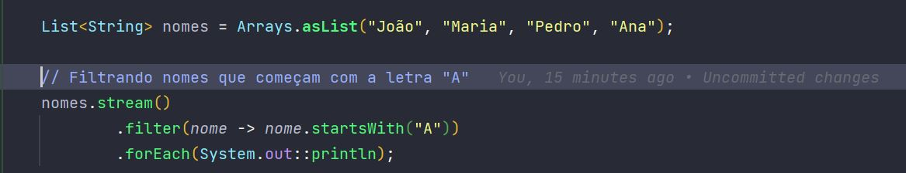

# Utilizando Stream API em Java

A Stream API é uma poderosa ferramenta em Java para operações de processamento de dados em coleções. Combinada com interfaces funcionais,
method references e lambdas, ela oferece uma abordagem elegante e funcional para lidar com conjuntos de dados.

## Functional Interfaces

As interfaces funcionais são a espinha dorsal da Stream API. Elas fornecem um contrato para a implementação de comportamentos específicos, permitindo que sejam passadas como parâmetros para métodos que esperam esses comportamentos.

## Method Reference

O método de referência é uma forma de expressão mais concisa para invocar um método. Ele simplifica a sintaxe de chamada de métodos e é frequentemente utilizado em conjunto com interfaces funcionais para tornar o código mais legível e limpo.

## Lambda Expressions

As expressões lambda são blocos de código que podem ser tratados como valores. Elas permitem a definição de comportamentos de forma mais concisa e inline. Em conjunto com as interfaces funcionais, as lambdas oferecem uma maneira elegante de passar comportamentos como argumentos para métodos.

### Exemplo de Uso

Neste exemplo, estamos utilizando a Stream API em conjunto com uma expressão lambda e um método de referência para filtrar e imprimir os nomes que começam com a letra "A".

A combinação da Stream API, interfaces funcionais, method references e lambdas proporciona uma maneira poderosa e eficiente de trabalhar com coleções em Java, permitindo escrever código mais claro e expressivo.
